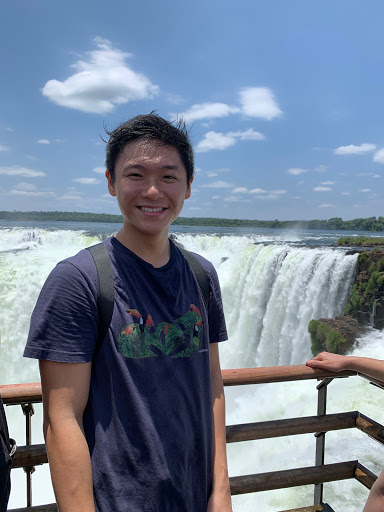

# Spice Girls
## 💃

### [Team10 Wiki](https://github.com/StanfordCS194/Team-10/wiki)

### Team Members

   
### Team skills matrix

Member | Skills | Personal Traits | Desired Growth | Weaknesses
--- | --- | --- | --- | ---
Buck | Design, Software Organization, AI, Games | Would like strong ownership over part of project | Finishing a reasonably scoped project | Has a hard time getting it done instead of spending too long finding the “right” way
Hikaru | Bioinformatics, ML | Disciplined, quick decision maker, enjoys learning new technologies | Developing a well thought-out product | Inexperience with App development
Philip | Swift iOS, Needfinding  Usertesting Experience, UX/UI | Creative, Open to exploring new ideas, love puzzles and board games | Gain programming experience, Build a minimum viable product in 9 weeks | No experience in ML
Nick | Machine Learning, AI, NLP, systems | Open-minded, Deadline and task oriented | Full stack product development, maybe iOS | Biased towards python/C++

### Project Synopsis
#### What features are lacking in zoom?
Live video transcripts

DL based hand raising detector 

DL based mouth movement detector

Making it better than meetings in real life

Deliverable will be web-based -simulation of our features

#### Cooperative skill development app
Angle on improving and skill sharing

Find new things to do in quarantine

ML: Match to people, match to activities

#### Game
Networking for multiplayer

Host multiple games

ML bot for single player

Philips’ Password Game

### Team Communication
Buck: bbukaty@stanford.edu

Hikaru: hhotta@stanford.edu

Philip: philronq@stanford.edu

Nick: nsteele@stanford.edu
